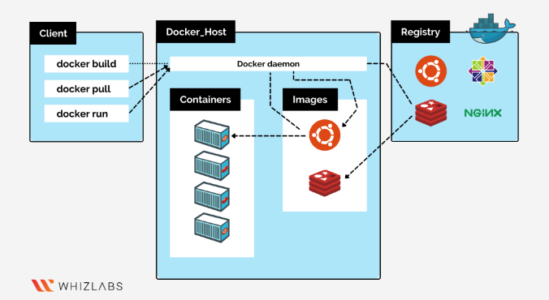
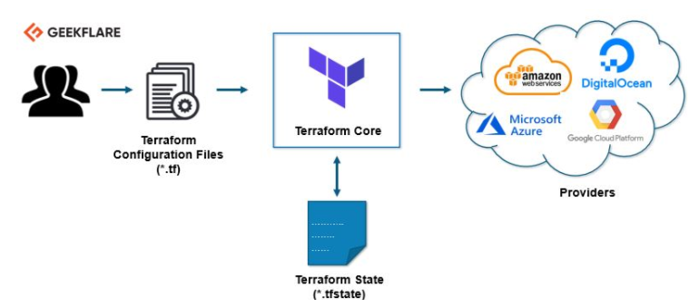

 

# Theory

## Infrastructure as Code

### Infrastructure
 
- Infrastructure is physical and virtual resources that is required to run an IT entity.
- Usually resources are individually configured using physical hardware configuration or any interactive configuration tools 

### Infrastructure as Code 

- So, the process of deploying, managing or deprovisioning these resources via machine-readable definition files is called IaC (Infrastructure as Code)
- Advantages of IaC are speed, cost and risk.

## Docker

### Container

- Container is lightweighted discrete OS within OS; lightweighted in sense that it only requires as much "OS" as an application requires 
- Containerization is the ability to create scalable destroyable env for number of application(s)   

### Docker as Container Host

- Docker is a Containerization tool that works as a host. 
- Its a platfrom as a service tool that uses OS level virtualization to ship application in containers 

### Docker Architecture

*Client*  
Primary way docker users interact with Docker

*Docker_Host*
Server where we install docker

*Images*
template to build docker container

*Registry*
stateless and scalable server side application that stores and lets you distribute docker images

## Terraform

### As IaC Tool

- Terraform is IaC software tool that enables users to create and manage mostly cloud infrastructure using declarative codes 
- It uses declarative language called HCL (HashiCorp Configuration language) or optionally JSON that enables user to 
safely and 

### Providers

- It uses providers to manage external resources like infrastructure, platform and software.
- Terraform supports almost all cloud infrastructure technologies like AWS, Azure, Google Cloud to name the few

### Terraform Architecture

## Author
Manish Ojha