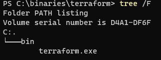
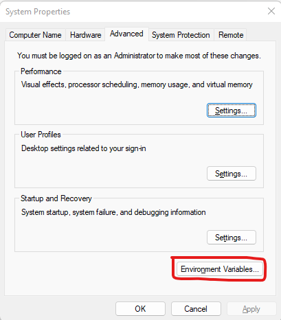
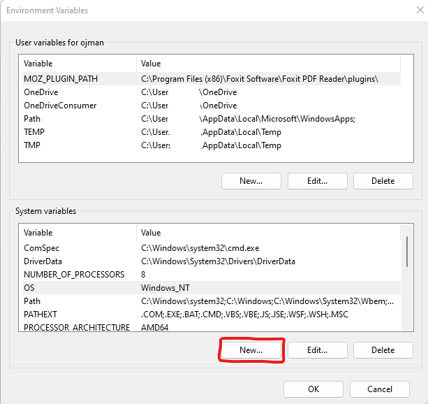
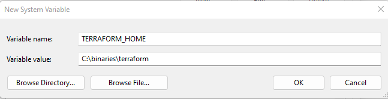
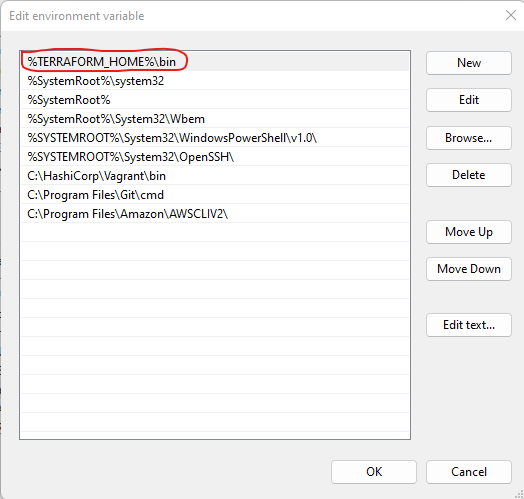
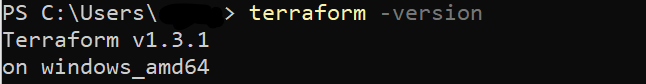

 

# Install

## Install Terraform

### Download
 
- Download Links for terraform

[Download For Windows] (https://releases.hashicorp.com/terraform/1.3.1/terraform_1.3.1_windows_amd64.zip)

[Download For Mac] (https://releases.hashicorp.com/terraform/1.3.1/terraform_1.3.1_darwin_arm64.zip)

- Create terraform dir and create bin dir within your workspace
- Unzip and move binary to bin dir

### Setting Variable

- Open Environment Variables from Advanced System Settings

- Set the location where we’ve created terraform folder as TERRAFORM_HOME

- Edit Path with “$TERRAFORM_HOME/bin"

- Check version on cmd

## Author
Manish Ojha